<div align="center">
  <a href="https://hilfing.dev"></a>
</div>

<p align="center">
  <a href="https://hilfing.dev"></a>
  <a href="mailto:contact@hilfing.dev"></a>
  <a href="https://t.me/hilfing"></a>
  <a href="https://discord.com/users/1479251885767790713"></a>
</p>

```console
$ whoami
full-stack developer · co-founder & sole developer @ AutoMint

$ uptime
4+ years of paid work · 150+ projects shipped · 120+ clients worldwide

$ automint --status
6,200+ active users · $400K+ monthly volume · ~423% peak MoM growth
```

## >_ deployments

| SYSTEM | STATUS | BRIEF |
|:-------|:-------|:------|
| **[AutoMint](https://automint.online)** | `ONLINE` | Cryptocurrency transaction intermediary & virtual marketplace — co-founded, built solo, end to end. Server-authoritative zero-trust escrow + anti-alt enforcement fusing 13+ device, account, and behaviour signals. |
| **[EquityExch](https://equityexch.com)** | `ONLINE` | Trading platform delivered under a $7,000 fixed-scope contract, retained for paid maintenance. Next.js 16 / FastAPI / Tatum rails for Solana & Litecoin, run on a self-managed VPS. |
| **Hylist** | `DISCONTINUED` | Fraud prevention & security intelligence for Web3 and gaming marketplaces — 1,600+ verified scammer identifications, 2,300+ processed reports. |
| **[JarvisAI](https://github.com/hilfing/JarvisAI)** | `OSS · GPL‑3.0` | Open-source AI assistant — 383 commits, four releases, DeepSource/Qodana quality pipelines. Evolved into Jarvis V2, a C#/Python client–server successor. |
| **[UrbanFlow](https://github.com/hilfing/UrbanFlow)** | `ARCHIVED` | ML traffic management prioritising emergency vehicles — TensorFlow route prediction, real-time GPS ingestion, Kotlin citizen app. |

## >_ stack

**applications & real-time**

<p>
  
  
  
  
  
  
  
</p>

**data & infrastructure**

<p>
  
  
  
  
  
  
  
</p>

**security, quality & ops**

<p>
  
  
  
  
  
  
</p>

## >_ telemetry

<div align="center">
  
</div>

<sub>Self-hosted panel — regenerated daily from the GitHub GraphQL API by <a href=".github/workflows/telemetry.yml">a scheduled Action</a>. No third-party stats services.</sub>

---

<div align="center">
  <sub><code>SYS_STATUS: ONLINE</code> · avg response &lt; 16H · © HILFING.DEV — ENCRYPTED_CONNECTION_ESTABLISHED</sub>
</div>
